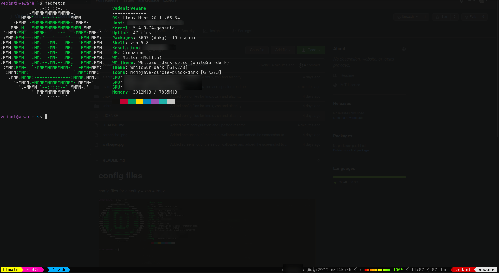
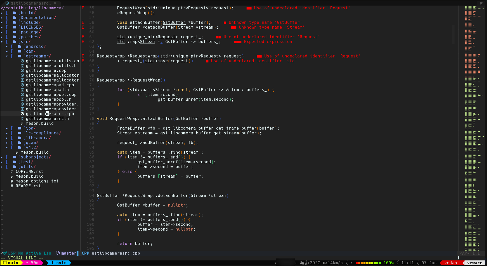

# config files

config files for alacritty + zsh + tmux

## Dependencies

* Alacritty
* zsh
* oh-my-zsh
* tmux
* powerline
* nvim (0.5.0+) (`sudo snap install nvim --edge --classic`)
* language servers (pyright, clangd, jsonls, cmake) from [here](https://github.com/neovim/nvim-lspconfig/blob/master/CONFIG.md)
* clangd10+

## Usage

* copy `alacritty` to `$HOME/.config/`
* copy `zshrc/.zshrc` to `$HOME/.`
* copy `tmux/.tmux.conf` and `tmux/.tmux.conf.local` to `$HOME/.`
* copy `nvim/lua` and `nvim/init.vim` to `$HOME/.config/nvim/.`
## Resources

* tmux config based on [.tmux](https://github.com/gpakosz/.tmux): Self-contained, pretty and versatile .tmux.conf configuration file.

